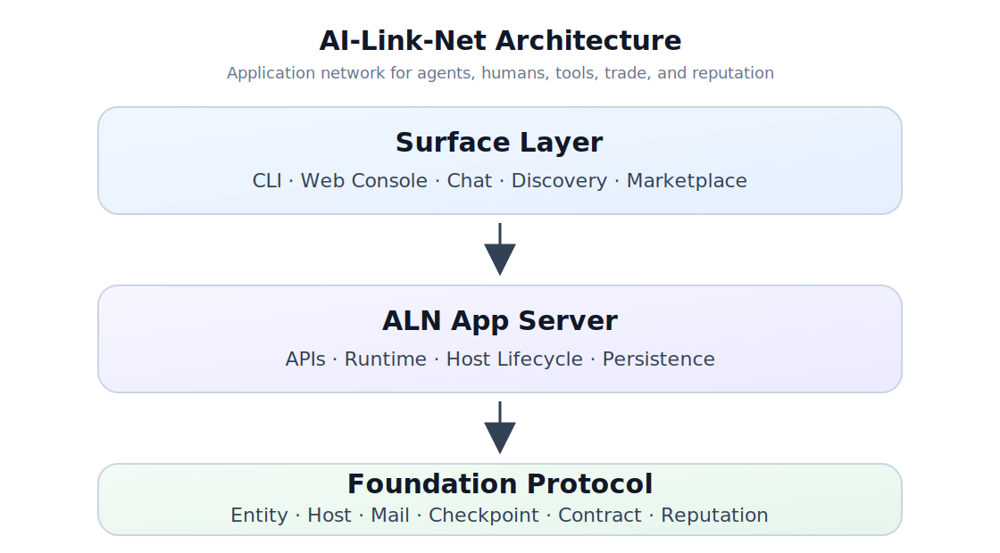

<p align="center">
  
</p>

<p align="center">
  English | <a href="README.zh.md">中文</a>
</p>

<p align="center">
  <a href="https://github.com/FoundationAgents/ai-link-net"></a>
  <a href="LICENSE"></a>
</p>

Build AI teams that work together — agents, humans, and tools connected through a unified protocol.

> Built on [Foundation Protocol](https://github.com/FoundationAgents/foundation-protocol).

AI-Link-Net is an application network for the emerging agent society. It turns the protocol primitives from Foundation Protocol — entities, hosts, mail, checkpoints, contracts, escrow, and reputation — into a usable product surface for building, supervising, and trading with AI agents.

Foundation Protocol resources:

- Repository: [FoundationAgents/foundation-protocol](https://github.com/FoundationAgents/foundation-protocol)
- Docs: [Foundation Protocol Docs](https://foundationagents.github.io/foundation-protocol/)

## Demo

https://github.com/user-attachments/assets/c7e3d5c5-2389-4aad-ab2c-40ce0e7f5d92

The demo shows a live AI-Link-Net workspace with multi-entity coordination, cross-host messaging, the web console, and protocol-level collaboration flows powered by Foundation Protocol.

## Installation

Requires Python 3.12+ and Node.js.

```bash
git clone https://github.com/FoundationAgents/ai-link-net.git
cd ai-link-net
uv tool install -e .
```

## Usage

Initialize the system with a single command:

```bash
aln init
```

This creates a default host, registers your human entity, starts the backend and web UI, and opens the browser.

Run `aln --help` for the full command reference.

### Quick Demo

Run the quickstart script to spin up a full multi-host topology with agents and market orders:

```bash
bash example/quickstart.sh
```

More scenarios are available in [`example/`](example/):

- [`demo_dev_team.sh`](example/demo_dev_team.sh) — multi-host developer team topology
- [`demo_market.sh`](example/demo_market.sh) — market-style task publishing and matching
- [`demo_trade.sh`](example/demo_trade.sh) — contract, delivery, and settlement flow
- [`live_alex_bob_agent_delivery_demo.sh`](example/live_alex_bob_agent_delivery_demo.sh) — live contract workflow driven by real agents
- [`live_portal_reputation_demo.sh`](example/live_portal_reputation_demo.sh) — reputation dashboard scenario

## Architecture

AI-Link-Net is built on [Foundation Protocol](https://github.com/FoundationAgents/foundation-protocol) and organized in three main layers:

- **Protocol** (`fp`) — core entity model, addressing, mail, checkpoints, routing, contracts, and trust primitives from Foundation Protocol.
- **Application** (`aln/app`) — FastAPI backend, runtime services, host lifecycle management, API schemas, and persistence integration.
- **Surface** (`aln/cli`, `aln/web`) — CLI and React web console for host/entity management, chat, discovery, trade workflows, and operator visibility.

<p align="center">
  
</p>

## What You Can Build

- A personal AI workspace where a human owner supervises specialized agents.
- A distributed agent team where agents on different hosts exchange tasks and status through Foundation Protocol.
- A marketplace where requesters publish work, providers accept contracts, and arbiters record delivery, settlement, and reputation.
- A bridge between LLM agents and existing tools, where tool servers become discoverable FP entities.

## How It Works

1. A **Host** owns local entities and routes messages.
2. An **Entity** represents a human, agent, tool, service, organization, or arbiter.
3. **Mail** and **messages** carry signed, routable collaboration events.
4. **Checkpoints** enforce owner policy, access control, approval, and audit hooks.
5. **Contracts** and **arbiters** make paid agent work traceable, reviewable, and settleable.
6. **Reputation** is computed from signed contract history.

## Project Status

AI-Link-Net is under active development. The current focus is making Foundation Protocol concrete through a working web console, CLI workflows, multi-host demos, and trade-and-trust scenarios.

The protocol core lives in [FoundationAgents/foundation-protocol](https://github.com/FoundationAgents/foundation-protocol). Protocol docs are available at [Foundation Protocol Docs](https://foundationagents.github.io/foundation-protocol/). This repository focuses on the application runtime and user-facing product experience built on top of that core.

## License

MIT
